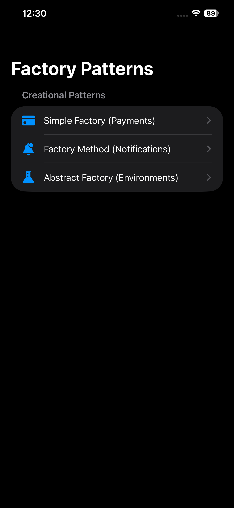
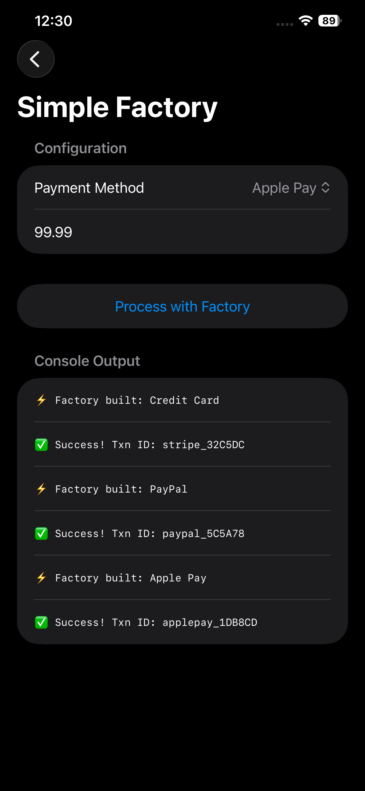
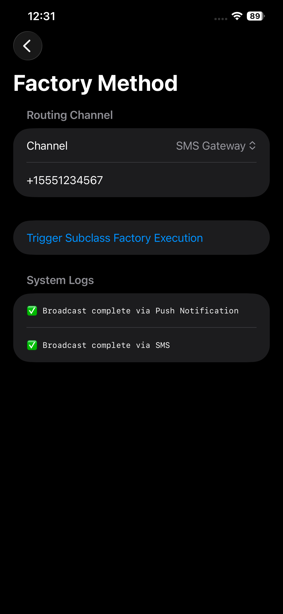
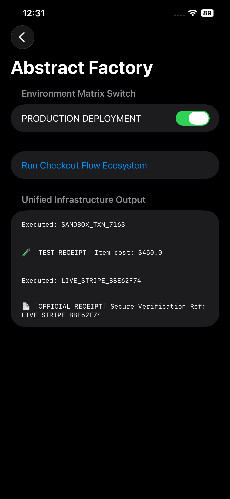

# Swift Factory Design Patterns Guide

[](https://swift.org)
[]()
[]()
[]()

This repository is the official production-ready companion codebase for the Medium article: **"Factory Design Pattern in Swift: Simple Factory, Factory Method & Abstract Factory — The Complete Guide"**.

## 📱 App Screenshots

| Main Dashboard | Simple Factory (Payments) |
| --- | --- |
|  |  |

| Factory Method (Notifications) | Abstract Factory (Environments) |
| --- | --- |
|  |  |

---

## 🚀 Overview

This project provides real-world, compiler-verified implementations of all three Factory pattern variations in Swift using **SwiftUI** and native structured concurrency (`async/await`). 

Instead of abstract or theoretical examples, this repository demonstrates how factories solve actual architecture issues in production-level iOS applications: decoupling payment gateways, scaling multi-channel notification engines, and cleanly isolating system runtime environments.

## 🛠️ Project Architecture & Modules

The codebase is meticulously organized into three modular layers to isolate responsibility and reflect real-world app structure:

1. **Simple Factory (Payment Systems):** Encapsulates runtime selection logic for payment gateways (`Stripe`, `PayPal`, `Apple Pay`) using a clean enum-driven architecture.
2. **Factory Method (Notification Channels):** Demonstrates Open/Closed object creation for expanding notification mechanisms (`Push`, `SMS`) natively using protocol-oriented extension signatures.
3. **Abstract Factory (Environment Isolation):** Coordinates entire object family variations seamlessly, guaranteeing your code safely builds compatible components for `Sandbox` vs. `Production` ecosystems without mixing types.

---

## 📂 Repository Layout

```text
Swift-Factory-Patterns-Guide/
│
├── README.md
├── .gitignore
├── screenshots/                      # Drop your image assets here!
│
├── SwiftFactoryPatterns/             # Main SwiftUI Application Target
│   ├── App/
│   │   └── SwiftFactoryPatternsApp.swift
│   ├── ContentView.swift             # Main Navigation Grid UI
│   │
│   ├── 1-SimpleFactory-Payments/
│   ├── 2-FactoryMethod-Notifications/
│   └── 3-AbstractFactory-Environments/
│
└── SwiftFactoryPatternsTests/        # Complete XCTest Target Suite
    ├── SimpleFactoryTests.swift
    ├── FactoryMethodTests.swift
    └── AbstractFactoryTests.swift
